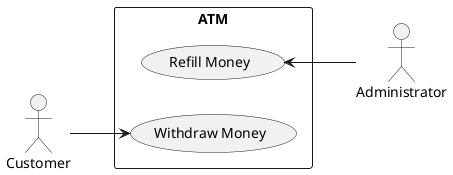
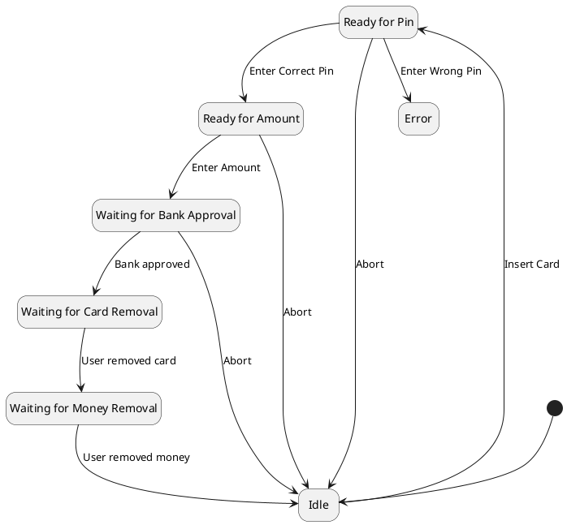

# PlantUML
## Installation
### Windows
1. Download Graphviz from the official website: https://graphviz.org/download/
1. Run the Graphviz installer and follow the installation instructions.
1. Download PlantUML from the official website: https://plantuml.com/download
1. Extract the downloaded PlantUML zip file to a desired location on your computer.
1. Add the location of the Graphviz bin folder to the system's PATH environment variable. This is usually `C:\Program Files\Graphviz\bin`.
Open a command prompt and navigate to the location where you extracted PlantUML.
1. Run the command `java -jar plantuml.jar -version` to verify that PlantUML is installed correctly.
   
That's it! You have successfully installed PlantUML and its dependencies on Windows. You can now use PlantUML to generate UML diagrams in your Markdown files.

### macOS
Using homebrew is recommended: In the terminal type `brew install plantuml`. This installs the package including all its dependencies.

### VS Code
In order to see PlantUML diagrams in the VS Code markdown preview the extension *Markdown Plantuml Preview* must be installed.


## PlantUML Reference Guide
- https://plantuml.com/guide: One large document covering all (lots of scrolling necessary)
- https://plantuml.com/use-case-diagram
- https://plantuml.com/activity-diagram-beta
- https://plantuml.com/state-diagram
- https://plantuml.com/class-diagram

## A Sample Use Case Diagram
```
@startuml
left to right direction
rectangle ATM {
    usecase "Withdraw Money" as wm
    usecase "Refill Money" as rm
}
:Administrator: -up-> rm
:Customer: -down-> wm
@enduml
```



## A Sample Activity Diagram: Money Withdrawal from an ATM
```
|Customer|
start
repeat
:Enter PIN;
repeat while (pin ok **and** number of attempts <= 3?) is (no)
if (number of attempts?) then (<=3)
    :Enter amount;
    |ATM|
    :Check Balance; <<output>>
    :Approved; <<input>>
    :Withdraw money; <<output>>
    :Return card;
    :Handout money;
else (> 3)
    |ATM|
    :Report error;
    :Confiscate card;
endif
|Customer|
stop
|ATM|
:not approved; <<input>>
:Report error;
:Confiscate card;
stop
|Bank|
start
:Check Balance; <<input>>
if (balance ok?) then (yes)
    :approved; <<output>>
else (no)
    :not approved; <<output>>
endif
stop

start
:Withdraw money; <<input>>
:Withdraw from account; 
stop
```



```plantuml
@startuml
|Customer|
start
repeat
:Enter PIN;
repeat while (pin ok **and** number of attempts <= 3?) is (no)
if (number of attempts?) then (<=3)
    :Enter amount;
    |ATM|
    :Check Balance; <<output>>
    :Approved; <<input>>
    :Withdraw money; <<output>>
    :Return card;
    :Handout money;
else (> 3)
    |ATM|
    :Report error;
    :Confiscate card;
endif
|Customer|
stop
|ATM|
:Not approved; <<input>>
:Report error;
:Confiscate card;
stop
|Bank|
start
:Check Balance; <<input>>
if (balance ok?) then (yes)
    :Approved; <<output>>
else (no)
    :Not approved; <<output>>
endif
stop

start
:Withdraw money; <<input>>
:Withdraw from account; 
stop
@enduml
```

## A Sample State Diagram

