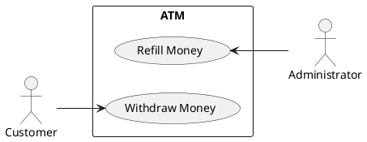

# UML Use Case Diagrams
Content can be taken from the presentation provided as pdf.
## A Simple Use Case Diagram

```plantuml
@startuml
left to right direction
rectangle ATM {
    usecase "Withdraw Money" as wm
    usecase "Refill Money" as rm
}
:Administrator: -up-> rm
:Customer: -down-> wm
@enduml
```
