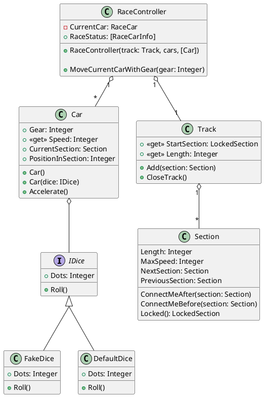
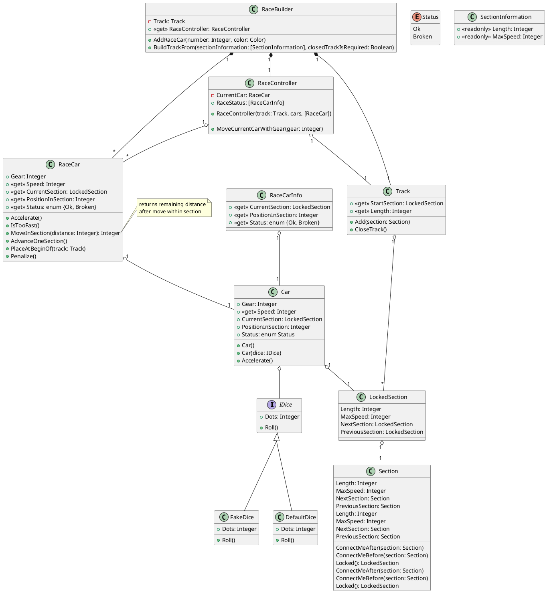

# Car Race
## UML Class Diagram
### First Draft

```plantuml
@startuml
skinparam groupInheritance 2

interface IDice {
    + Dots: Integer 
    + Roll()
}

class FakeDice {
    + Dots: Integer 
    + Roll()
}

class DefaultDice {
    + Dots: Integer 
    + Roll()
}

IDice <|-- FakeDice
IDice <|-- DefaultDice

class Car {
    + Gear: Integer
    + <<get>> Speed: Integer
    + CurrentSection: Section
    + PositionInSection: Integer

    + Car()
    + Car(dice: IDice)
    + Accelerate()
}
Car o-- IDice

class Section {
    Length: Integer
    MaxSpeed: Integer
    NextSection: Section
    PreviousSection: Section
    ConnectMeAfter(section: Section)
    ConnectMeBefore(section: Section)
    Locked(): LockedSection
}

class Track {
    + <<get>> StartSection: LockedSection
    + <<get>> Length: Integer

    + Add(section: Section)
    + CloseTrack()
}
Track "1" o-- "*" Section

class RaceController {
    - CurrentCar: RaceCar
    + RaceStatus: [RaceCarInfo]

    + RaceController(track: Track, cars, [Car])

    + MoveCurrentCarWithGear(gear: Integer)
}
RaceController "1" o-- "*" Car
RaceController "1" o-- "1" Track
@enduml
```

### Full Version

```plantuml
@startuml
skinparam groupInheritance 2

interface IDice {
    + Dots: Integer 
    + Roll()
}

class FakeDice {
    + Dots: Integer 
    + Roll()
}

class DefaultDice {
    + Dots: Integer 
    + Roll()
}

IDice <|-- FakeDice
IDice <|-- DefaultDice

class Car {
    + Gear: Integer
    + <<get>> Speed: Integer
    + CurrentSection: LockedSection
    + PositionInSection: Integer
    + Status: enum Status

    + Car()
    + Car(dice: IDice)
    + Accelerate()
}

enum Status {
    Ok
    Broken
}

class Section {
    Length: Integer
    MaxSpeed: Integer
    NextSection: Section
    PreviousSection: Section
    ConnectMeAfter(section: Section)
    ConnectMeBefore(section: Section)
    Locked(): LockedSection
}

Car o-- IDice
Car "1" o-- "1" LockedSection

class RaceCar {
    + Gear: Integer
    + <<get>> Speed: Integer
    + <<get>> CurrentSection: LockedSection
    + <<get>> PositionInSection: Integer
    + <<get>> Status: enum {Ok, Broken}

    + Accelerate()
    + IsTooFast()
    + MoveInSection(distance: Integer): Integer
    + AdvanceOneSection()
    + PlaceAtBeginOf(track: Track)
    + Penalize()
}

note right of RaceCar::MoveInSection
    returns remaining distance
    after move within section
endnote

RaceCar "1" o-- "1" Car

class RaceCarInfo {
    + <<get>> CurrentSection: LockedSection
    + <<get>> PositionInSection: Integer
    + <<get>> Status: enum {Ok, Broken}
}
RaceCarInfo "1" o-- "1" Car

class Section {
    Length: Integer
    MaxSpeed: Integer
    NextSection: Section
    PreviousSection: Section
    ConnectMeAfter(section: Section)
    ConnectMeBefore(section: Section)
    Locked(): LockedSection
}

LockedSection "1" o-- "1" Section

class LockedSection {
    Length: Integer
    MaxSpeed: Integer
    NextSection: LockedSection
    PreviousSection: LockedSection
}

class Track {
    + <<get>> StartSection: LockedSection
    + <<get>> Length: Integer

    + Add(section: Section)
    + CloseTrack()
}
Track "1" o-- "*" LockedSection

class RaceController {
    - CurrentCar: RaceCar
    + RaceStatus: [RaceCarInfo]

    + RaceController(track: Track, cars, [RaceCar])

    + MoveCurrentCarWithGear(gear: Integer)
}
RaceController "1" o-- "*" RaceCar
RaceController "1" o-- "1" Track

class RaceBuilder {
    - Track: Track
    + <<get>> RaceController: RaceController

    + AddRaceCar(number: Integer, color: Color)
    + BuildTrackFrom(sectionInformation: [SectionInformation], closedTrackIsRequired: Boolean)
}
RaceBuilder "1" *-- "1" RaceController
RaceBuilder "1" *-- "1" Track
RaceBuilder "1" *-- "*" RaceCar

class SectionInformation {
    + <<readonly>> Length: Integer
    + <<readonly>> MaxSpeed: Integer
}
@enduml
```