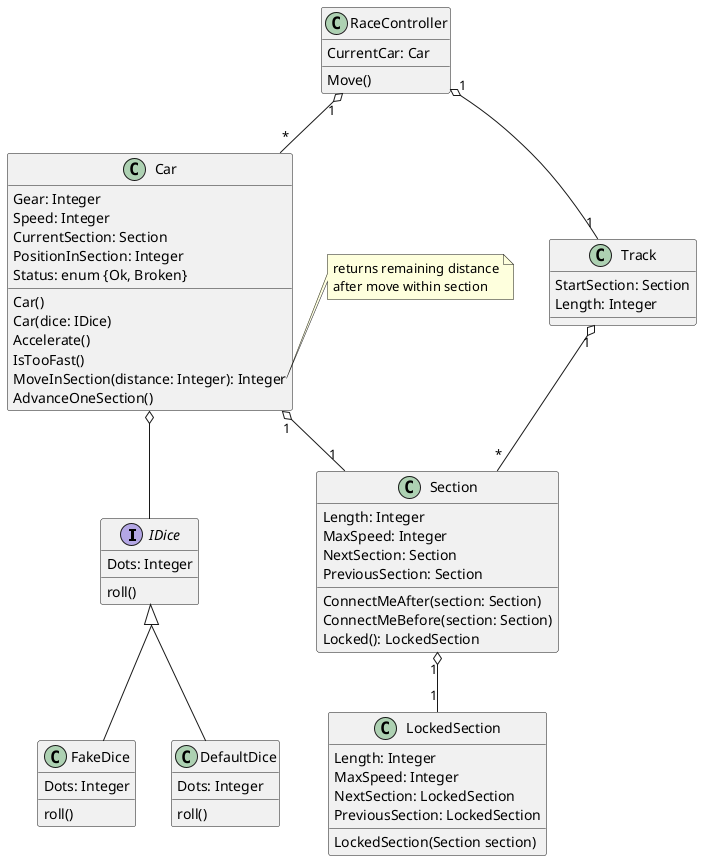

# Car Race
## UML Class Diagram

```plantuml
@startuml
skinparam groupInheritance 2

interface IDice {
    Dots: Integer 
    roll()
}

class FakeDice {
    Dots: Integer 
    roll()
}

class DefaultDice {
    Dots: Integer 
    roll()
}

IDice <|-- FakeDice
IDice <|-- DefaultDice


class Car {
    Gear: Integer
    Speed: Integer
    CurrentSection: Section
    PositionInSection: Integer
    Status: enum {Ok, Broken}

    Car()
    Car(dice: IDice)
    Accelerate()
    IsTooFast()
    MoveInSection(distance: Integer): Integer
    AdvanceOneSection()
}

note right of Car::MoveInSection
    returns remaining distance
    after move within section
endnote

Car o-- IDice
Car "1" o-- "1" Section

class Section {
    Length: Integer
    MaxSpeed: Integer
    NextSection: Section
    PreviousSection: Section
    ConnectMeAfter(section: Section)
    ConnectMeBefore(section: Section)
    Locked(): LockedSection
}

Section "1" o-- "1" LockedSection

class LockedSection {
    Length: Integer
    MaxSpeed: Integer
    NextSection: LockedSection
    PreviousSection: LockedSection

    LockedSection(Section section)
}

class Track
Track : StartSection: Section
Track : Length: Integer
Track "1" o-- "*" Section

class RaceController {
    CurrentCar: Car
    Move()
}
RaceController "1" o-- "*" Car
RaceController "1" o-- "1" Track

@enduml
```